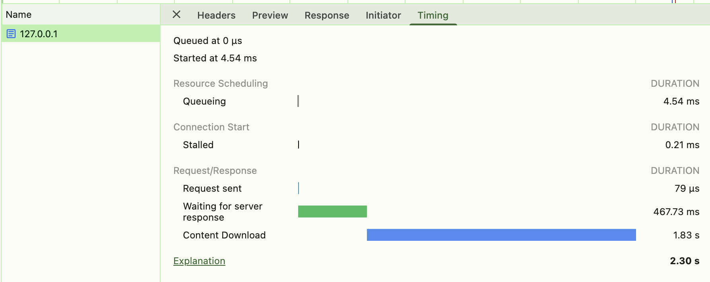

# Streaming

Similar to before, we have a slow API. This time the slow API streams us each PR using json-lines.
In main.rs `req_handler`, you will see we're waiting until the full response has been received before continuing.

Goals: We should stream out the response body instead.

To test that it's working properly, you can open your browser's developer tools and navigate to the "Network" tab.
Refresh the page and you should see the request being made. Clicking on that request, you should be able to open a timings view.

If you have implemented streaming correctly, the timings should look like they do abov, where most of the time is spent in "content downloading".
If you see most of the time in "Waiting for server response", then it is not yet streaming the results out.
